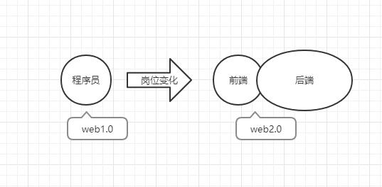

#### 大事记
- 1990年12月，欧洲核子研究中心（CERN）的科学家 Tim Berners-Lee 发明了万维网（World Wide Web）
- 1992年底，美国国家超级电脑应用中心（NCSA）开始开发一个独立的浏览器，叫做 Mosaic
- 1995年4月，Netscape 公司雇佣了程序员 Brendan Eich 开发这种网页脚本语言，Brendan Eich 只用了10天，就设计完成了这种语言的第一版，最初名字叫做 Mocha，1995年9月改为 LiveScript。
- 1997年7月，ECMA 组织发布262号标准文件（ECMA-262）的第一版，规定了浏览器脚本语言的标准，并将这种语言称为 ECMAScript
- 2005年2月，AJAX这个词第一次正式提出。标志着从 Web1.0 到 Web2.0的过渡。
- 2009年，Node 项目诞生，它是服务器上的 JavaScript 运行环境。
- 2010年，第一个前端 MVC 框架 Backbone.js 诞生

## 大前端
大前端 = web前端(传统) + 各种端(移动端，物联网) + node

### 什么是web 前端
这里可以用一道题来解释，思考一下`从输入URL到页面呈现在你面前到底发生了什么?`

** 简单的说：** 
1. DNS (Domain Name System) 解析
2. TCP (Transmission Control Protocol) 链接
3. HTTP (HyperText Transfer Protocol) 请求
4. HTTP 响应
5. HTML解析 & CSS渲染
6. JS 解析执行

在最早的时候，并没有前后端概念。在那个年代，程序员用Dreamweaver 写 html 静态页面，然后部署到一台电脑的 IIS (Internet Information Services) 上。当请求这个页面时，返回这个 html 文件。

之后服务端变得复杂了一些，html页面开始使用各种模板来写。例如：java -> freemarker。但是，此时，前后端开发还是一体的。或者前端仅负责把设计图编程静态页面(俗称`切图`)。其他的模板编写基本属于后端范畴。

到了 2005年 **Ajax (Asynchronous JavaScript and XML) 的诞生，彻底得改变了这一切。** ---- js脚本可以独立向服务器请求数据，拿到数据后，再进行处理并更新网页，在这个过程中，后端只负责提供数据，其他事情都有前端来做。 

由此粗犷的概括下： 
**前端**： 针对浏览器的开发，代码在浏览器中运行
**后端**： 针对服务器的开发，代码在服务器中运行

_(未完待续...)_

---
> [前端发展简史](https://mp.weixin.qq.com/s/E16Ory2WJPaByyTsj_JEVA)
> [大前端的技术原理和变迁史](https://zhuanlan.zhihu.com/p/40715650)
> [前端是什么](https://www.zhihu.com/search?type=content&q=%E4%BB%80%E4%B9%88%E6%98%AF%E5%89%8D%E7%AB%AF)
