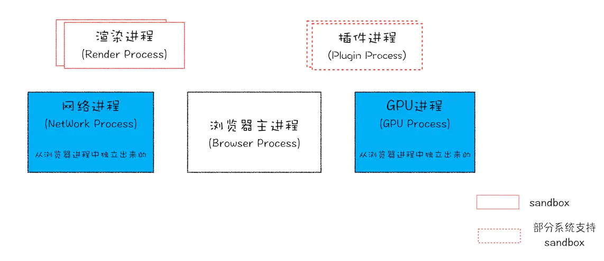

#  浏览器及其工作原理？(Browsers and how they work?)

## 了解现代多进程浏览器


如图所示，最新的Chrome浏览器包括：
- 1个浏览器主进程
- 1个GPU进程
- 1个网络进程
- 多个渲染进程
- 多个插件进程

下面我们来说明每隔进程的功能：
- **浏览器进程**：主要负责界面显示、用户交互、子进程管理，同时提供存储等功能。
- **渲染进程**：核心任务是将HTML、CSS和JS转换为用户可以与之交互的网页，排版引擎 Blink 和 JS 引擎 V8 都是运行在该进程中。默认情况下，Chrome会为每个`Tab`标签创建一个渲染进程。出于安全考虑，渲染进程都是运行在沙箱模式下。
- **GPU进程**：在一开始的时候Chrome是没有GPU进程的，GPU 的使用初衷是为了实现 3D CSS 的效果，只是随后网页、Chrome 的 UI 界面都选择采用 GPU 来绘制，这使得 GPU 成为浏览器普遍的需求。最后，Chrome 在其多进程架构上也引入了 GPU 进程。
- 网络进程：主要负责页面的网络资源加载，之前是作为一个模块运行在浏览器进程里面的，直至最近才独立出来，成为一个单独的进程。
- 插件进程：主要是负责插件的运行，因插件易崩溃，所以需要通过插件进程来隔离，以保证插件进程崩溃不会对浏览器和页面造成影响。

两面性：

- **更高的资源占用**：因为每个进程都会包含公共基础结构的副本（如 JavaScript 运行环境），这就意味着浏览器会消耗更多的内存资源。
- **更复杂的体系架构**：浏览器各模块之间耦合性高、扩展性差等问题，会导致现在的架构已经很难适应新的需求了

## HTTP请求流程


如图所示，浏览器的HTTP请求从发起到结束一共经历了如下8个阶段：
1. 构建请求
2. 查找缓存
3. 准备IP和端口
4. 等待TCP队列
5. 建立TCP队列
6. 发起HTTP请求
7. 服务器处理请求
8. 服务器返回请求和断开连接

### 具体流程
当我们在浏览器里键入 `www.baidu.com` 会发生什么？

#### 1. 构建请求
首先，浏览器构建 **请求行** 信息(如下)，构建好后，浏览器准备发起网络请求。
```
GET /index.html HTTP1.1
```

#### 2. 查找缓存
在真正发起网络请求之前，浏览器会先在浏览器缓存中查询是否有要请求的文件。其中，**浏览器缓存是一种在本地保存资源副本，以供下次请求时直接使用的技术**。  
当浏览器发现请求的资源已经在浏览器缓存中存有副本，它会拦截请求，返回该资源的副本，并直接结束请求，而不会再去源服务器重新下载。
<!-- () -->

这样做的优点：
- 缓解服务器端压力，提升性能（获取资源的耗时更短了）；
- 对于网站来说，缓存是实现快速资源加载的重要组成部分。

当然，如果缓存查找失败，就会进入网络请求过程了。


#### 3. 准备IP和端口

#### 4. 等待TCP队列

#### 5. 建立TCP队列

#### 6. 发起HTTP请求

#### 7. 服务器处理请求

#### 8. 服务器返回请求和断开连接


 > [参考1](https://juejin.im/post/5f007d32f265da22b64936bf?utm_source=gold_browser_extension)